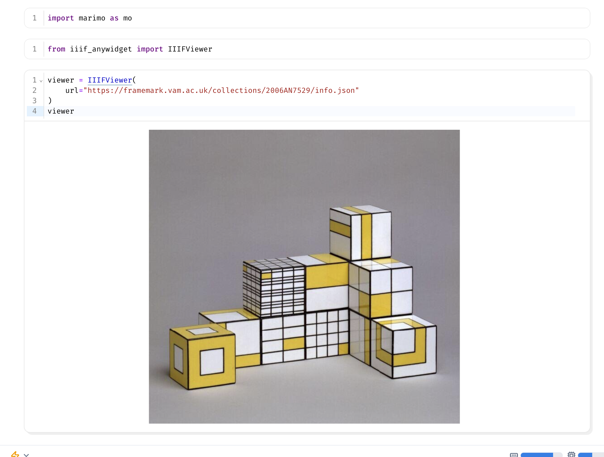
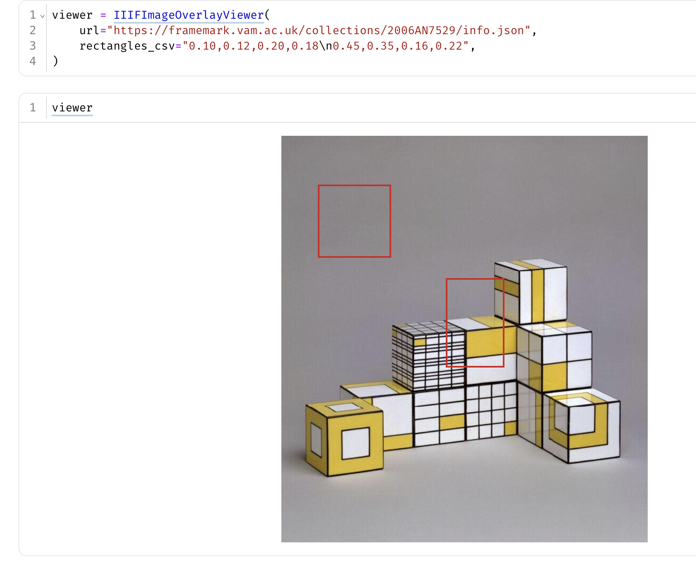

# iiif-anywidget

`anywidget`s to work with images served from IIIF sources in marimo notebooks.


## 1. IIIF image viewer widget

A complete marimo notebook:




## 2. IIIF manifest browser


```python
from iiif_anywidget import IIIFThumbnailGallery

gallery = IIIFThumbnailGallery(
	manifest_url="https://manifests.sub.uni-goettingen.de/iiif/presentation/PPN623133725/manifest"
)
gallery
```

Manifest browser + image viewer in a marimo notebook:


## 3a. IIIF image overlay viewer

```python
from iiif_anywidget import IIIFImageOverlayViewer

viewer = IIIFImageOverlayViewer(
	url="https://framemark.vam.ac.uk/collections/2006AN7529/info.json",
	rectangles_csv="0.10,0.12,0.20,0.18\n0.45,0.35,0.16,0.22",
)
viewer
```

A complete overlay viewer:




## 3b. IIIF image overlay viewer observing user actions


The `IIIFImageOverlayViewer` widget tracks instances of alt- (option) click as pixel values, and normalized to a percentage exprtessed as 0.0-1.0. Getting access to these values requires a little more set up. We need to create the marimo states we can listen to:

```python
coords_state, set_coords_state = mo.state(
    {
        "pixel_x": -1.0,
        "pixel_y": -1.0,
        "normalized_x": -1.0,
        "normalized_y": -1.0,
    }
)
```

We attach a `viewer.observe(...)` handler to the widget traits (`pixel_x`, `pixel_y`, `normalized_x`, `normalized_y`) and pushes trait changes to that state.

```python
names = ["pixel_x", "pixel_y", "normalized_x", "normalized_y"]

old_observer = getattr(viewer, "_marimo_observer", None)
if old_observer is not None:
    viewer.unobserve(old_observer, names=names)

viewer.observe(push_state, names=names)
viewer._marimo_observer = push_state
push_state()
```

A utility function to update values from the `viewer` object:

```python
def push_state(_change=None):
    "Update value of coordinates state from viewer object."
    set_coords_state(
        {
            "pixel_x": float(viewer.pixel_x),
            "pixel_y": float(viewer.pixel_y),
            "normalized_x": float(viewer.normalized_x),
            "normalized_y": float(viewer.normalized_y),
        }
    )
```


Without this bridge, reading `viewer.pixel_x` directly in a markdown cell is often non-reactive in marimo, so the UI may not refresh even though the widget traits are changing.